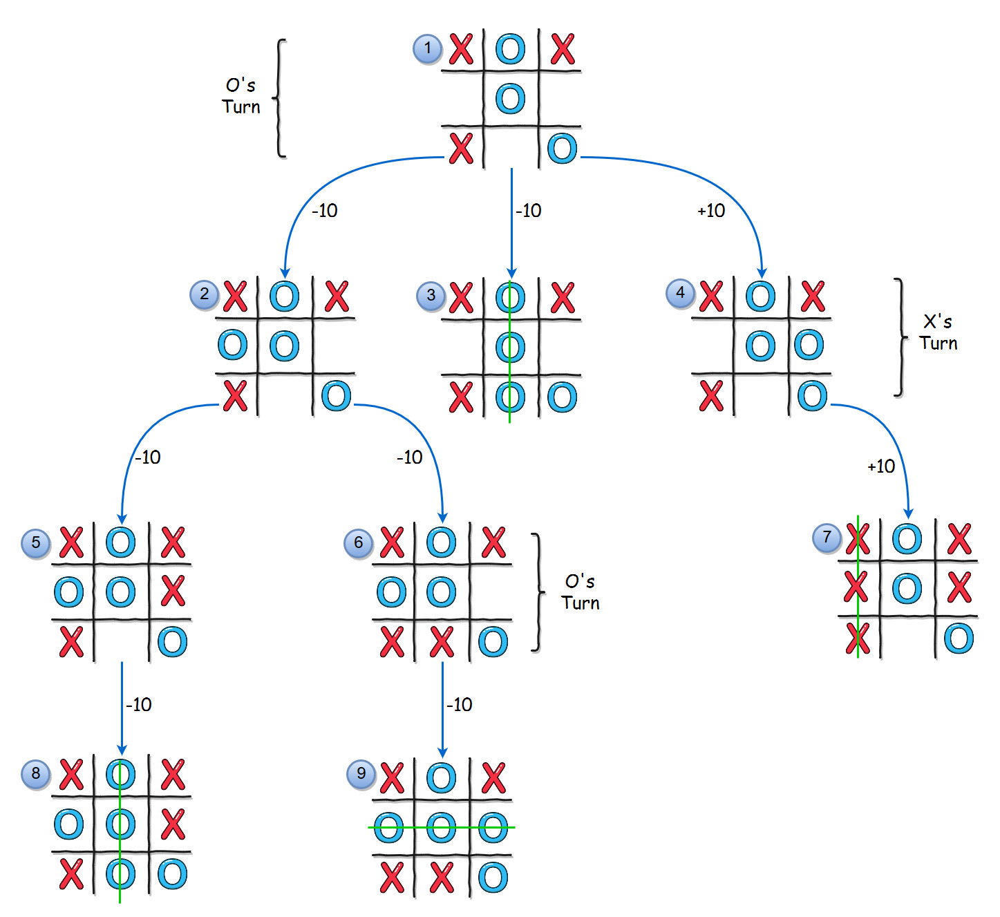
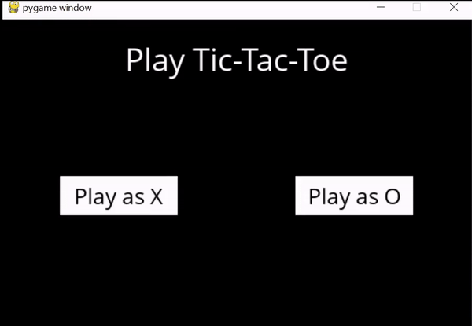

# Tic-tac-toe with MINIMAX 

  

 

Tic-tac-toe, one of the most classic and simple games to play. Surely you must have played with your friends at some point in your life.
With the advancement of technology, it allowed us to use this game as a model to validate the artificial intelligence algorithm called <b>MINIMAX</b>. 
Therefore, this algorithm is the main key in this tic-tac-toe.

- To run the Game script just run:
    - <b>python runner.py</b>
 
# Problem 
To get a better understanding of the concepts of the search algorithms, we were challenged to implement a tic-tac-toe using the classic <b>MINIMAX</b> 
algorithm and getting its best performance.

# Objective 
To obtain the best performance using the MINIMAX algorithm in a competition of two agents in the face of the tic-tac-toe game, where an agent only wants 
to maximize his victory points, but for the other side, what matters is to maximize the defeat points.

# Solution  

  

To solve this problem with 100% success. We need to create the following variables: 
- <b>X = player 1</b>
- <b>O = player 2</b>

if <b>X</b> wins you will get <b>+1</b>, but if you win, you’ll get <b>-1</b>, in the event of a tie, the score will be <b>0</b>.
after defining the awards, we declare the following functions:
   
- <b>initial_state()</b> - Function that will receive the initial state of the board. 
- <b>player()</b> - Function that will receive the current state of the board and will return the turn of the next player/agent. 
- <b>actions()</b> - Function that will receive the current board and will return the possible actions that the agent can perform in his turn. 
- <b>result()</b> - Function that will receive the status of the current board and the agent's action. Returning the board with the current actions. 
- <b>winner()</b> - Function that will receive the board and check if there will be any sequence that will determine if the game is over, tied or a victory for any of the agents. Returning <b>X</b>, <b>O</b> or none. 
- <b>terminal()</b> - You will receive the board and check whether the game is over or not, if it is over it will return <b>TRUE</b>, otherwise it will return <b>FALSE</b>. 
- <b>utility()</b> - Function that receives the final state of the board and will return <b>1</b> if <b>X</b> won and <b>-1</b> if <b>O</b> won. 
- <b>minimax()</b> - Function that contains the implemented <b>MINIMAX AlGORITHM</b>. 
- <b>minimax_aux()</b> - Function that will make the best search possible to obtain the expected result. 
